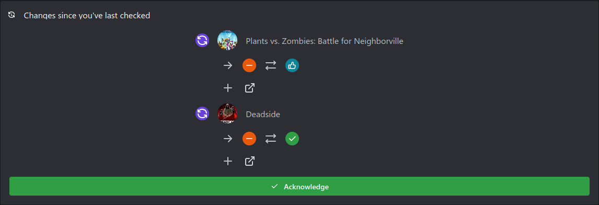

# Are We Anti-Cheat?

An alternative frontend for [areweanticheatyet.com](https://areweanticheatyet.com/).

### New Features
- Tracks changes since you've last visited the page ([AreWeAntiCheatYet#376](https://github.com/Starz0r/AreWeAntiCheatYet/issues/376))
- Improved (Mobile-)Layout
- Game Icons

This project also maintains it's own overrides list which is used to add an additional state "running", which will be given to games that have not publicly announced support for linux but run ([AreWeAntiCheatYet#180 (Comment)](https://github.com/Starz0r/AreWeAntiCheatYet/issues/180#issuecomment-952925001)).

# Technologies used
- [React](https://reactjs.org/)
- [Mantine](https://mantine.dev/)
- [Tabler Icons](https://tabler-icons.io/)

# Screenshots

- Changes List
    